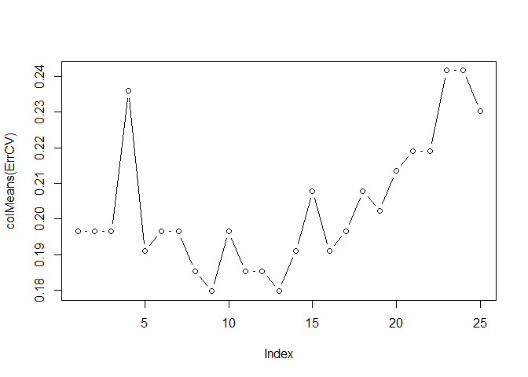
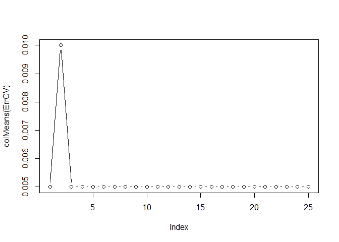
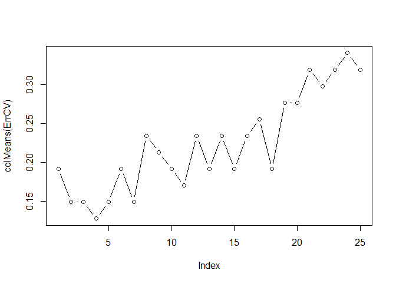
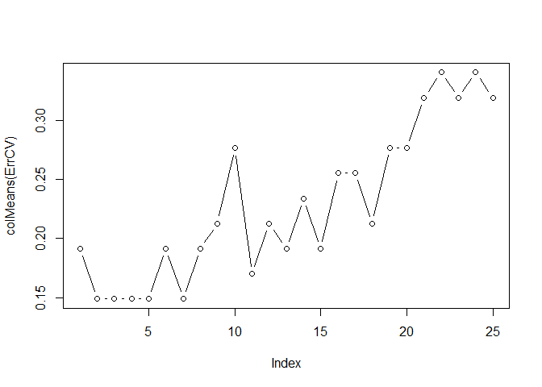
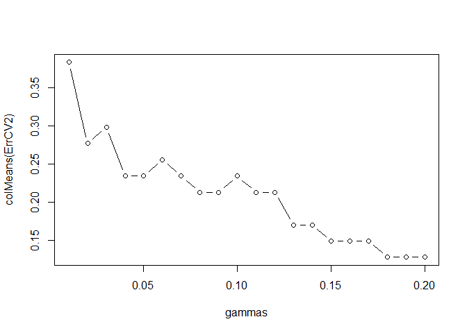

Learning process with Classification algorithms
================

# Classification with kNN, logistic regression and LDA

So, let’s consider some data:

``` r
library(MBCbook)
data("wine27")
data("banknote")
```

## KNN

Let’s use kNN to try classify those data:

``` r
N = nrow(wine27)
X = wine27[,1:27]
Y = wine27$Type
train = sample(1:N,150)

# Use knn to classify
library(class)
knn.out = knn(X[train,],X[-train,],Y[train],k=3) # k-nearest neighbour classification for test set from training set
```

``` r
knn.out
```

    ##  [1] Barolo     Barolo     Barolo     Barolo     Barolo     Barolo    
    ##  [7] Barolo     Barolo     Barolo     Barolo     Grignolino Grignolino
    ## [13] Grignolino Grignolino Grignolino Barbera    Grignolino Barbera   
    ## [19] Barbera    Barbera    Barbera    Barbera    Barbera    Barbera   
    ## [25] Barbera    Barolo     Grignolino Grignolino
    ## Levels: Barbera Barolo Grignolino

We can now compute the validation error:

``` r
sum(knn.out != Y[-train]) / length(knn.out)
```

    ## [1] 0.2142857

Let’s try now the LOO-CV to get a better estimate of the error of kNN on
these data:

``` r
ErrCV = rep(NA,N)
# Estimation of the error with LOO-CV
for (i in 1:nrow(X)){
  # Split between train and validation
  train = seq(1,nrow(X))[-i]
  
  # Learning step
  knn.out = knn(X[train,],X[-train,],Y[train],k=3)
  
  # compute the error
  ErrCV[i] = sum(knn.out != Y[-train]) / length(knn.out)
}

mean(ErrCV)
```

    ## [1] 0.2022472

We can observe that the 3-NN produces an average classification error
around 20%, which is not very satisfying. A way to improve it is to test
other values of k and to use CV for pick the most appropriate k for
those data :

``` r
ErrCV = matrix(NA,N,25)

for (k in 1:25){
  for (i in 1:nrow(X)){
    # Split between train and validation
    train = seq(1,nrow(X))[-i]
    
    # Learning step
    knn.out = knn(X[train,],X[-train,],Y[train],k=k)
    
    # cmopute the error
    ErrCV[i,k] = sum(knn.out != Y[-train]) / length(knn.out)
  }
}

plot(colMeans(ErrCV),type='b')
```

<!-- -->

``` r
which.min(colMeans(ErrCV))
```

    ## [1] 9

It turns out that the best solution that we can have with KNN is with
k=9.

## LDA

Let’s now use LDA to classify the same data:

``` r
N = nrow(wine27)
X = wine27[,1:27]
Y = wine27$Type
train = sample(1:N,150)

# LDA learning step
library(MASS)
lda.fit = lda(X[train,],Y[train])

# LDA prediction step
yhat = predict(lda.fit,X[-train,])$class

# Validation error
sum(yhat != Y[-train]) / length(yhat)
```

    ## [1] 0

> Note: the estimated classifier `lda.fit` contains the maximum
> likelihood estimates for model parameters
> (lda.fit\(prior = pi, lda.fit\)means = mu, lda.fit$scaling = Sigma).

Let’s now use LOO-CV to get a good estimate of the actual classification
error of LDA for this wine classification problem :

``` r
ErrCV = rep(NA,N)
# Estimation of the error with LOO-CV
for (i in 1:nrow(X)){
  # Split between train and validation
  train = seq(1,nrow(X))[-i]
  
  # Learning and classification step
  lda.fit = lda(X[train,],Y[train])
  yhat = predict(lda.fit,X[-train,])$class
  
  # compute the error
  ErrCV[i] = sum(yhat != Y[-train]) / length(yhat)
}

mean(ErrCV)
```

    ## [1] 0.01123596

So, for this wine classification problem, LDA clearly outperforms kNN.
This decision is based on the respective evaluations of the
classification error with LOO-CV for LDA (0.01 ) and kNN (0.18 with
k=9).

## Logistic regression

The logistic regression is available in R thanks to the `glm` function.
Let’s recall that this method is limited to binary classification. Let’s
therefore consider a different classification problem for now: the
detection of counterfeit bank notes.

``` r
data("banknote")
X = banknote[,-1] # remove target variable 'Status'
Y = banknote$Status # Status variable is counterfeit (= 1) or genuine (= 2)

# Split into train / validation
train = sample(1:nrow(X),0.75*nrow(X))

# Learn the logistic regression model
f = glm(Status ~ ., data = banknote, subset = train, family = 'binomial')
```

    ## Warning: glm.fit: algorithm did not converge

    ## Warning: glm.fit: fitted probabilities numerically 0 or 1 occurred

``` r
# Classify the validation data
log.out = predict(f, newdata = X[-train,])
yhat = as.numeric(log.out > 0) + 1 

# Compute the classification error
sum(yhat != as.numeric(Y[-train])) / sum(yhat)
```

    ## [1] 0.01315789

So, finally, we can now compare on this problem kNN, LDA and logistic
regression, thanks to LOO-CV.

If we would like to do in the best way, we first have to select the most
appropriate k for KNN on this problem :

``` r
N = nrow(X)
ErrCV = matrix(NA,N,25)
for (k in 1:25){
  for (i in 1:nrow(X)){
    # Split between train and validation
    train = seq(1,nrow(X))[-i]
    
    # Learning step
    knn.out = knn(X[train,],X[-train,],Y[train],k=k)
    
    # compute the error
    ErrCV[i,k] = sum(knn.out != Y[-train]) / length(knn.out)
  }
}

plot(colMeans(ErrCV),type='b')
```

<!-- -->

``` r
kstar = which.min(colMeans(ErrCV))
```

And now, we can compare LDA, LReg and KNN (k=kstar)

``` r
ErrCV.kNN = rep(NA,N)
ErrCV.LDA = rep(NA,N)
ErrCV.LReg = rep(NA,N)

# Estimation of the error with LOO-CV
for (i in 1:nrow(X)){
  # Split between train and validation
  train = seq(1,nrow(X))[-i]
  
  # LDA
  lda.out = lda(X[train,],Y[train])
  yhat = predict(lda.out,X[-train,])$class
  ErrCV.LDA[i] = sum(yhat != Y[-train]) / length(yhat)
  
  # Logistic regression
  f = glm(Status ~ .,data = banknote, subset = train,family = 'binomial')
  log.out = predict(f,newdata = X[-train,])
  yhat = as.numeric(log.out > 0) + 1 
  ErrCV.LReg[i] = sum(yhat != as.numeric(Y[-train])) / sum(yhat)
  
  # KNN (k = kstar)
  knn.out = knn(X[train,],X[-train,],Y[train],k=kstar)
  ErrCV.kNN[i] = sum(knn.out != Y[-train]) / length(knn.out)
}
Err = cbind(ErrCV.kNN,ErrCV.LDA,ErrCV.LReg)
colMeans(Err)
```

    ##  ErrCV.kNN  ErrCV.LDA ErrCV.LReg 
    ##     0.0050     0.0050     0.0175

``` r
apply(Err,2,sd)
```

    ##  ErrCV.kNN  ErrCV.LDA ErrCV.LReg 
    ## 0.07071068 0.07071068 0.11623815

Based on those results, we can recommend to put in production either
1-NN or LDA to classify the banknotes, and we expect a future
classification error of 0.5% (sd 0.07).

## Application to the Swiss data

> Exercise: compare KNN, LDA and LogReg for classifying those data,
> thanks to LOO-CV.

``` r
data(swiss)
swiss
```

    ##              Fertility Agriculture Examination Education Catholic
    ## Courtelary        80.2        17.0          15        12     9.96
    ## Delemont          83.1        45.1           6         9    84.84
    ## Franches-Mnt      92.5        39.7           5         5    93.40
    ## Moutier           85.8        36.5          12         7    33.77
    ## Neuveville        76.9        43.5          17        15     5.16
    ## Porrentruy        76.1        35.3           9         7    90.57
    ## Broye             83.8        70.2          16         7    92.85
    ## Glane             92.4        67.8          14         8    97.16
    ## Gruyere           82.4        53.3          12         7    97.67
    ## Sarine            82.9        45.2          16        13    91.38
    ## Veveyse           87.1        64.5          14         6    98.61
    ## Aigle             64.1        62.0          21        12     8.52
    ## Aubonne           66.9        67.5          14         7     2.27
    ## Avenches          68.9        60.7          19        12     4.43
    ## Cossonay          61.7        69.3          22         5     2.82
    ## Echallens         68.3        72.6          18         2    24.20
    ## Grandson          71.7        34.0          17         8     3.30
    ## Lausanne          55.7        19.4          26        28    12.11
    ## La Vallee         54.3        15.2          31        20     2.15
    ## Lavaux            65.1        73.0          19         9     2.84
    ## Morges            65.5        59.8          22        10     5.23
    ## Moudon            65.0        55.1          14         3     4.52
    ## Nyone             56.6        50.9          22        12    15.14
    ## Orbe              57.4        54.1          20         6     4.20
    ## Oron              72.5        71.2          12         1     2.40
    ## Payerne           74.2        58.1          14         8     5.23
    ## Paysd'enhaut      72.0        63.5           6         3     2.56
    ## Rolle             60.5        60.8          16        10     7.72
    ## Vevey             58.3        26.8          25        19    18.46
    ## Yverdon           65.4        49.5          15         8     6.10
    ## Conthey           75.5        85.9           3         2    99.71
    ## Entremont         69.3        84.9           7         6    99.68
    ## Herens            77.3        89.7           5         2   100.00
    ## Martigwy          70.5        78.2          12         6    98.96
    ## Monthey           79.4        64.9           7         3    98.22
    ## St Maurice        65.0        75.9           9         9    99.06
    ## Sierre            92.2        84.6           3         3    99.46
    ## Sion              79.3        63.1          13        13    96.83
    ## Boudry            70.4        38.4          26        12     5.62
    ## La Chauxdfnd      65.7         7.7          29        11    13.79
    ## Le Locle          72.7        16.7          22        13    11.22
    ## Neuchatel         64.4        17.6          35        32    16.92
    ## Val de Ruz        77.6        37.6          15         7     4.97
    ## ValdeTravers      67.6        18.7          25         7     8.65
    ## V. De Geneve      35.0         1.2          37        53    42.34
    ## Rive Droite       44.7        46.6          16        29    50.43
    ## Rive Gauche       42.8        27.7          22        29    58.33
    ##              Infant.Mortality
    ## Courtelary               22.2
    ## Delemont                 22.2
    ## Franches-Mnt             20.2
    ## Moutier                  20.3
    ## Neuveville               20.6
    ## Porrentruy               26.6
    ## Broye                    23.6
    ## Glane                    24.9
    ## Gruyere                  21.0
    ## Sarine                   24.4
    ## Veveyse                  24.5
    ## Aigle                    16.5
    ## Aubonne                  19.1
    ## Avenches                 22.7
    ## Cossonay                 18.7
    ## Echallens                21.2
    ## Grandson                 20.0
    ## Lausanne                 20.2
    ## La Vallee                10.8
    ## Lavaux                   20.0
    ## Morges                   18.0
    ## Moudon                   22.4
    ## Nyone                    16.7
    ## Orbe                     15.3
    ## Oron                     21.0
    ## Payerne                  23.8
    ## Paysd'enhaut             18.0
    ## Rolle                    16.3
    ## Vevey                    20.9
    ## Yverdon                  22.5
    ## Conthey                  15.1
    ## Entremont                19.8
    ## Herens                   18.3
    ## Martigwy                 19.4
    ## Monthey                  20.2
    ## St Maurice               17.8
    ## Sierre                   16.3
    ## Sion                     18.1
    ## Boudry                   20.3
    ## La Chauxdfnd             20.5
    ## Le Locle                 18.9
    ## Neuchatel                23.0
    ## Val de Ruz               20.0
    ## ValdeTravers             19.5
    ## V. De Geneve             18.0
    ## Rive Droite              18.2
    ## Rive Gauche              19.3

``` r
X = swiss[,-5]
Y = as.numeric(swiss$Catholic >= 50)
# S = X; S$Y = Y

# Choice of k for kNN
N = nrow(X)
ErrCV = matrix(NA,N,25)
for (k in 1:25){
  for (i in 1:N){
    # Split between train and validation
    train = seq(1,N)[-i]
    
    # Learning step
    out = knn(X[train,],X[-train,],Y[train],k=k)
    
    # compute the error
    ErrCV[i,k] = sum(out != Y[-train])
  }
}

plot(colMeans(ErrCV),type='b')
```

<!-- -->

``` r
kstar = which.min(colMeans(ErrCV))

# Comparison of the three methods
ErrCV.kNN = rep(NA,N)
ErrCV.LDA = rep(NA,N)
ErrCV.LReg = rep(NA,N)

# Estimation of the error with LOO-CV
for (i in 1:N){
  # Split between train and validation
  train = seq(1,N)[-i]
  
  # LDA
  f = lda(X[train,],Y[train])
  yhat = predict(f,X[-train,])$class
  ErrCV.LDA[i] = sum(yhat != Y[-train])
  
  # Logistic regression
  f = glm(Y ~ .,data = X, subset = train, family = 'binomial')
  out = predict(f,newdata = X[-train,])
  yhat = as.numeric(out > 0)
  ErrCV.LReg[i] = sum(yhat != Y[-train])
  
  # KNN (k = kstar)
  out = knn(X[train,],X[-train,],Y[train],k=kstar)
  ErrCV.kNN[i] = sum(out != Y[-train]) / length(out)
}
Err = cbind(ErrCV.kNN,ErrCV.LDA,ErrCV.LReg)
colMeans(Err)
```

    ##  ErrCV.kNN  ErrCV.LDA ErrCV.LReg 
    ##  0.1702128  0.1489362  0.1276596

``` r
apply(Err,2,sd)
```

    ##  ErrCV.kNN  ErrCV.LDA ErrCV.LReg 
    ##  0.3798826  0.3598746  0.3373181

## Support Vector Machines SVM

``` r
# install.packages("e1071")
library(e1071)
```

Let’s first test SVM with the linear kernel on the iris dataset and
compare it with LDA

``` r
# Comparison of the three methods
N = nrow(X)
ErrCV.SVM = rep(NA,N)
ErrCV.LDA = rep(NA,N)

# Estimation of the error with LOO-CV
for (i in 1:N){
  # Split between train and validation
  train = seq(1,N)[-i]
  
  # LDA
  f = lda(X[train,],Y[train])
  yhat = predict(f,X[-train,])$class
  ErrCV.LDA[i] = sum(yhat != Y[-train])
  
  # SVM
  model = svm(X[train,], Y[train], type='C-classification', kernel = 'linear')
  yhat = predict(model, X[-train,])
  ErrCV.SVM[i] = sum(yhat != Y[-train])
  
}
Err = cbind(ErrCV.SVM,ErrCV.LDA)
colMeans(Err)
```

    ##  ErrCV.SVM  ErrCV.LDA 
    ## 0.08510638 0.14893617

``` r
apply(Err,2,sd)
```

    ## ErrCV.SVM ErrCV.LDA 
    ## 0.2820567 0.3598746

> Exercise: try with the RBF kernel with gamma = 0.5

``` r
# Comparison of the three methods
ErrCV.SVM = rep(NA,nrow(X))
ErrCV.LDA = rep(NA,nrow(X))
# Estimation of the error with LOO-CV
for (i in 1:nrow(X)){
  # Split between train and validation
  train = seq(1,nrow(X))[-i]
  
  # LDA
  f = lda(X[train,],Y[train])
  yhat = predict(f,X[-train,])$class
  ErrCV.LDA[i] = sum(yhat != Y[-train]) 
  
  # SVM
  model = svm(X[train,],Y[train],type='C-classification',
              kernel = "radial",gamma = 0.5)
  yhat =  predict(model,X[-train,])
  ErrCV.SVM[i] = sum(yhat != Y[-train]) 
}
Err = cbind(ErrCV.SVM,ErrCV.LDA)
colMeans(Err)
```

    ## ErrCV.SVM ErrCV.LDA 
    ## 0.1063830 0.1489362

``` r
apply(Err,2,sd)
```

    ## ErrCV.SVM ErrCV.LDA 
    ## 0.3116605 0.3598746

Exercice: try to find the best value of gamma with the RBF kernel

``` r
# Find the best value of gamma
N = nrow(X)
gammas = c((1:10)/100,0.1+(1:10)/100) # values are chosen in order to reach a minimum of the error when gamma increases (plot below)
ErrCV = matrix(NA,N,length(gammas))

for (j in 1:length(gammas)){
  for (i in 1:N){
    # Split between train and validation
    train = seq(1,N)[-i]
    
    # Learning step
    model = svm(X[train,], Y[train], type='C-classification', kernel = 'radial', gamma = gammas[j])
    yhat = predict(model, X[-train,])
    
    # compute the error
    ErrCV[i,j] = sum(yhat != Y[-train])
  }
}

plot(gammas, colMeans(ErrCV), type='b')
```

<!-- -->

``` r
bestgamma = gammas[which.min(colMeans(ErrCV))]

# Comparison of the three methods
ErrCV.SVM = rep(NA,N)
ErrCV.LDA = rep(NA,N)

# Estimation of the error with LOO-CV
for (i in 1:N){
  # Split between train and validation
  train = seq(1,N)[-i]
  
  # LDA
  f = lda(X[train,],Y[train])
  yhat = predict(f,X[-train,])$class
  ErrCV.LDA[i] = sum(yhat != Y[-train])
  
  # SVM
  model = svm(X[train,], Y[train], type='C-classification', kernel = 'radial', gamma = bestgamma)
  yhat = predict(model, X[-train,])
  ErrCV.SVM[i] = sum(yhat != Y[-train])
  
}
Err = cbind(ErrCV.SVM,ErrCV.LDA)
colMeans(Err)
```

    ## ErrCV.SVM ErrCV.LDA 
    ## 0.1276596 0.1489362

``` r
apply(Err,2,sd)
```

    ## ErrCV.SVM ErrCV.LDA 
    ## 0.3373181 0.3598746

Exercice: Compare all methods (kNN, LDA, QDA, SVM) on the wine dataset

``` r
data(swiss)
swiss
```

    ##              Fertility Agriculture Examination Education Catholic
    ## Courtelary        80.2        17.0          15        12     9.96
    ## Delemont          83.1        45.1           6         9    84.84
    ## Franches-Mnt      92.5        39.7           5         5    93.40
    ## Moutier           85.8        36.5          12         7    33.77
    ## Neuveville        76.9        43.5          17        15     5.16
    ## Porrentruy        76.1        35.3           9         7    90.57
    ## Broye             83.8        70.2          16         7    92.85
    ## Glane             92.4        67.8          14         8    97.16
    ## Gruyere           82.4        53.3          12         7    97.67
    ## Sarine            82.9        45.2          16        13    91.38
    ## Veveyse           87.1        64.5          14         6    98.61
    ## Aigle             64.1        62.0          21        12     8.52
    ## Aubonne           66.9        67.5          14         7     2.27
    ## Avenches          68.9        60.7          19        12     4.43
    ## Cossonay          61.7        69.3          22         5     2.82
    ## Echallens         68.3        72.6          18         2    24.20
    ## Grandson          71.7        34.0          17         8     3.30
    ## Lausanne          55.7        19.4          26        28    12.11
    ## La Vallee         54.3        15.2          31        20     2.15
    ## Lavaux            65.1        73.0          19         9     2.84
    ## Morges            65.5        59.8          22        10     5.23
    ## Moudon            65.0        55.1          14         3     4.52
    ## Nyone             56.6        50.9          22        12    15.14
    ## Orbe              57.4        54.1          20         6     4.20
    ## Oron              72.5        71.2          12         1     2.40
    ## Payerne           74.2        58.1          14         8     5.23
    ## Paysd'enhaut      72.0        63.5           6         3     2.56
    ## Rolle             60.5        60.8          16        10     7.72
    ## Vevey             58.3        26.8          25        19    18.46
    ## Yverdon           65.4        49.5          15         8     6.10
    ## Conthey           75.5        85.9           3         2    99.71
    ## Entremont         69.3        84.9           7         6    99.68
    ## Herens            77.3        89.7           5         2   100.00
    ## Martigwy          70.5        78.2          12         6    98.96
    ## Monthey           79.4        64.9           7         3    98.22
    ## St Maurice        65.0        75.9           9         9    99.06
    ## Sierre            92.2        84.6           3         3    99.46
    ## Sion              79.3        63.1          13        13    96.83
    ## Boudry            70.4        38.4          26        12     5.62
    ## La Chauxdfnd      65.7         7.7          29        11    13.79
    ## Le Locle          72.7        16.7          22        13    11.22
    ## Neuchatel         64.4        17.6          35        32    16.92
    ## Val de Ruz        77.6        37.6          15         7     4.97
    ## ValdeTravers      67.6        18.7          25         7     8.65
    ## V. De Geneve      35.0         1.2          37        53    42.34
    ## Rive Droite       44.7        46.6          16        29    50.43
    ## Rive Gauche       42.8        27.7          22        29    58.33
    ##              Infant.Mortality
    ## Courtelary               22.2
    ## Delemont                 22.2
    ## Franches-Mnt             20.2
    ## Moutier                  20.3
    ## Neuveville               20.6
    ## Porrentruy               26.6
    ## Broye                    23.6
    ## Glane                    24.9
    ## Gruyere                  21.0
    ## Sarine                   24.4
    ## Veveyse                  24.5
    ## Aigle                    16.5
    ## Aubonne                  19.1
    ## Avenches                 22.7
    ## Cossonay                 18.7
    ## Echallens                21.2
    ## Grandson                 20.0
    ## Lausanne                 20.2
    ## La Vallee                10.8
    ## Lavaux                   20.0
    ## Morges                   18.0
    ## Moudon                   22.4
    ## Nyone                    16.7
    ## Orbe                     15.3
    ## Oron                     21.0
    ## Payerne                  23.8
    ## Paysd'enhaut             18.0
    ## Rolle                    16.3
    ## Vevey                    20.9
    ## Yverdon                  22.5
    ## Conthey                  15.1
    ## Entremont                19.8
    ## Herens                   18.3
    ## Martigwy                 19.4
    ## Monthey                  20.2
    ## St Maurice               17.8
    ## Sierre                   16.3
    ## Sion                     18.1
    ## Boudry                   20.3
    ## La Chauxdfnd             20.5
    ## Le Locle                 18.9
    ## Neuchatel                23.0
    ## Val de Ruz               20.0
    ## ValdeTravers             19.5
    ## V. De Geneve             18.0
    ## Rive Droite              18.2
    ## Rive Gauche              19.3

``` r
N = nrow(X)
X = swiss[,-5]
Y = as.numeric(swiss$Catholic >= 50)
# S = X; S$Y = Y


# Choice of k for kNN

ErrCV = matrix(NA,N,25)
for (k in 1:25){
  for (i in 1:N){
    # Split between train and validation
    train = seq(1,N)[-i]
    
    # Learning step
    out = knn(X[train,],X[-train,],Y[train],k=k)
    
    # compute the error
    ErrCV[i,k] = sum(out != Y[-train])
  }
}
plot(colMeans(ErrCV),type='b')
```

<!-- -->

``` r
kstar = which.min(colMeans(ErrCV))


# Choice of gamma for SVM RBF

gammas = c((1:10)/100,0.1+(1:10)/100) # values are chosen in order to reach a minimum for the error when gamma increases (plot below)
ErrCV2 = matrix(NA,N,length(gammas))
for (j in 1:length(gammas)){
  for (i in 1:N){
    # Split between train and validation
    train = seq(1,N)[-i]
    
    # Learning step
    out2 = svm(X[train,], Y[train], type='C-classification', kernel = 'radial', gamma = gammas[j])
    yhat = predict(out2, X[-train,])
    
    # compute the error
    ErrCV2[i,j] = sum(yhat != Y[-train])
  }
}
plot(gammas, colMeans(ErrCV2), type='b')
```

<!-- -->

``` r
bestgamma = gammas[which.min(colMeans(ErrCV2))]


# Comparison of the three methods

ErrCV.kNN = rep(NA,N)
ErrCV.LReg = rep(NA,N)
ErrCV.LDA = rep(NA,N)
ErrCV.QDA = rep(NA,N)
ErrCV.SVM = rep(NA,N)

# Estimation of the error with LOO-CV
for (i in 1:N){
  # Split between train and validation
  train = seq(1,nrow(X))[-i]

  # KNN (k = kstar)
  knn.out = knn(X[train,],X[-train,],Y[train],k=kstar)
  ErrCV.kNN[i] = sum(knn.out != Y[-train]) / length(knn.out)
  
  # Logistic regression
  lreg.model = glm(Y ~ .,data = X, subset = train, family = 'binomial')
  lreg.out = predict(lreg.model,newdata = X[-train,])
  lreg.yhat = as.numeric(lreg.out > 0)
  ErrCV.LReg[i] = sum(lreg.yhat != Y[-train])
    
  # LDA
  lda.model = lda(X[train,], Y[train])
  lda.yhat = predict(lda.model, X[-train,])$class
  ErrCV.LDA[i] = sum(lda.yhat != Y[-train])
  
  # QDA
  qda.model = qda(X[train,], Y[train])
  qda.yhat = predict(qda.model, X[-train,])$class
  ErrCV.QDA[i] = sum(qda.yhat != Y[-train])
  
  # SVM (gamma = bestgamma)
  svm.model = svm(X[train,], Y[train], type='C-classification', kernel = 'radial', gamma = bestgamma)
  svm.yhat = predict(svm.model, X[-train,])
  ErrCV.SVM[i] = sum(svm.yhat != Y[-train])
  
}
Err = cbind(ErrCV.kNN, ErrCV.LReg, ErrCV.LDA, ErrCV.QDA, ErrCV.SVM)
sort(colMeans(Err), decreasing = TRUE)
```

    ##  ErrCV.kNN  ErrCV.QDA  ErrCV.LDA ErrCV.LReg  ErrCV.SVM 
    ##  0.2553191  0.1702128  0.1489362  0.1276596  0.1276596

``` r
# apply(Err,2,sd)
```
