Clustering
================

# Clustering

## The kmeans

This method is available in R in the package `class`:

``` r
library(class)
```

Let’s consider again the `swiss` data for illustrating the use of
kmeans:

``` r
data("swiss")

kmeans.out  = kmeans(swiss, centers = 3)
kmeans.out
```

    ## K-means clustering with 3 clusters of sizes 6, 10, 31
    ## 
    ## Cluster means:
    ##   Fertility Agriculture Examination Education Catholic Infant.Mortality
    ## 1  74.96667    83.20000     6.50000  4.666667 99.47833         17.78333
    ## 2  83.90000    54.91000    11.20000  7.800000 94.15300         22.57000
    ## 3  64.77097    42.99032    20.12903 13.225806 12.75355         19.51290
    ## 
    ## Clustering vector:
    ##   Courtelary     Delemont Franches-Mnt      Moutier   Neuveville   Porrentruy 
    ##            3            2            2            3            3            2 
    ##        Broye        Glane      Gruyere       Sarine      Veveyse        Aigle 
    ##            2            2            2            2            2            3 
    ##      Aubonne     Avenches     Cossonay    Echallens     Grandson     Lausanne 
    ##            3            3            3            3            3            3 
    ##    La Vallee       Lavaux       Morges       Moudon        Nyone         Orbe 
    ##            3            3            3            3            3            3 
    ##         Oron      Payerne Paysd'enhaut        Rolle        Vevey      Yverdon 
    ##            3            3            3            3            3            3 
    ##      Conthey    Entremont       Herens     Martigwy      Monthey   St Maurice 
    ##            1            1            1            1            2            1 
    ##       Sierre         Sion       Boudry La Chauxdfnd     Le Locle    Neuchatel 
    ##            1            2            3            3            3            3 
    ##   Val de Ruz ValdeTravers V. De Geneve  Rive Droite  Rive Gauche 
    ##            3            3            3            3            3 
    ## 
    ## Within cluster sum of squares by cluster:
    ## [1]   706.7855  2213.7172 28886.7225
    ##  (between_SS / total_SS =  73.2 %)
    ## 
    ## Available components:
    ## 
    ## [1] "cluster"      "centers"      "totss"        "withinss"     "tot.withinss"
    ## [6] "betweenss"    "size"         "iter"         "ifault"

A simple way to look at the clustering:

``` r
pairs(swiss,col = kmeans.out$cluster, pch=19)
```

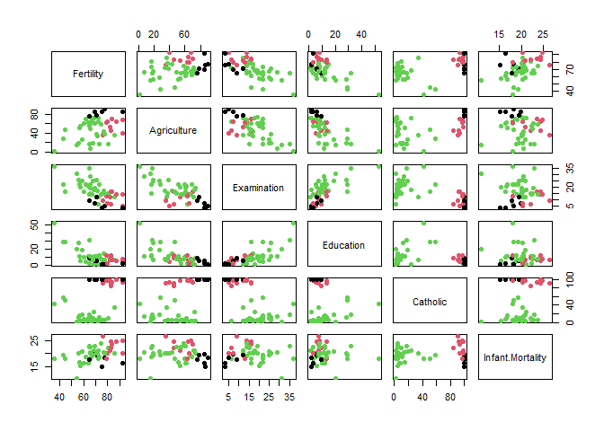<!-- -->

Of course, it usually first necessary to find the right value for K:

``` r
J = c()
for (k in 1:15){
  kmeans.out = kmeans(swiss, centers = k, nstart = 10)
  J[k] = kmeans.out$betweenss / kmeans.out$totss
}

plot(J,type='b')
```

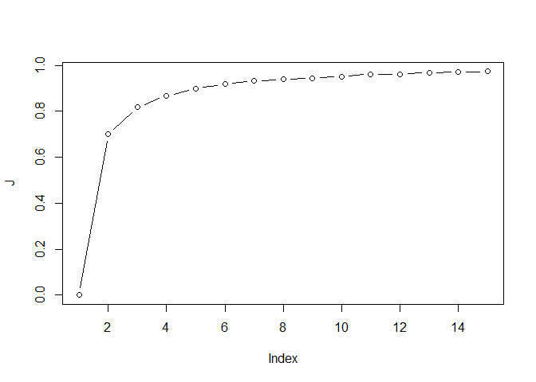<!-- -->

``` r
Kstar = 4 # my choice!
```

let’s run the algorithm again with the optimized value of k

``` r
kmeans.out = kmeans(swiss,centers = Kstar, nstart = 10)
kmeans.out
```

    ## K-means clustering with 4 clusters of sizes 16, 16, 12, 3
    ## 
    ## Cluster means:
    ##   Fertility Agriculture Examination Education Catholic Infant.Mortality
    ## 1  80.55000    65.51875     9.43750   6.62500 96.15000         20.77500
    ## 2  66.31250    60.72500    16.93750   7.68750  6.45875         19.55000
    ## 3  68.70000    23.80000    23.16667  14.66667 11.74333         19.71667
    ## 4  40.83333    25.16667    25.00000  37.00000 50.36667         18.50000
    ## 
    ## Clustering vector:
    ##   Courtelary     Delemont Franches-Mnt      Moutier   Neuveville   Porrentruy 
    ##            3            1            1            3            2            1 
    ##        Broye        Glane      Gruyere       Sarine      Veveyse        Aigle 
    ##            1            1            1            1            1            2 
    ##      Aubonne     Avenches     Cossonay    Echallens     Grandson     Lausanne 
    ##            2            2            2            2            3            3 
    ##    La Vallee       Lavaux       Morges       Moudon        Nyone         Orbe 
    ##            3            2            2            2            2            2 
    ##         Oron      Payerne Paysd'enhaut        Rolle        Vevey      Yverdon 
    ##            2            2            2            2            3            2 
    ##      Conthey    Entremont       Herens     Martigwy      Monthey   St Maurice 
    ##            1            1            1            1            1            1 
    ##       Sierre         Sion       Boudry La Chauxdfnd     Le Locle    Neuchatel 
    ##            1            1            3            3            3            3 
    ##   Val de Ruz ValdeTravers V. De Geneve  Rive Droite  Rive Gauche 
    ##            3            3            4            4            4 
    ## 
    ## Within cluster sum of squares by cluster:
    ## [1] 6532.906 2759.445 4490.257 1839.879
    ##  (between_SS / total_SS =  86.8 %)
    ## 
    ## Available components:
    ## 
    ## [1] "cluster"      "centers"      "totss"        "withinss"     "tot.withinss"
    ## [6] "betweenss"    "size"         "iter"         "ifault"

``` r
pairs(swiss, col = kmeans.out$cluster, pch=19)
```

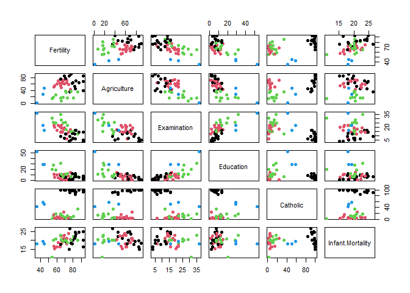<!-- -->

## The hierarchical clustering

The hierarchical clustering is available in R within the `class`
package:

``` r
library(class)
```

> Notice that the input data are not the actual data but a distance
> matrix between all obseravtions

``` r
D = dist(swiss) # Compute the distance matrix between all observations => this will avoid a lot of computations when calling hclust function
hc.out = hclust(D,method='complete')
hc.out
```

    ## 
    ## Call:
    ## hclust(d = D, method = "complete")
    ## 
    ## Cluster method   : complete 
    ## Distance         : euclidean 
    ## Number of objects: 47

To look at the result, we have to plot the dendrogram:

``` r
plot(hc.out)
```

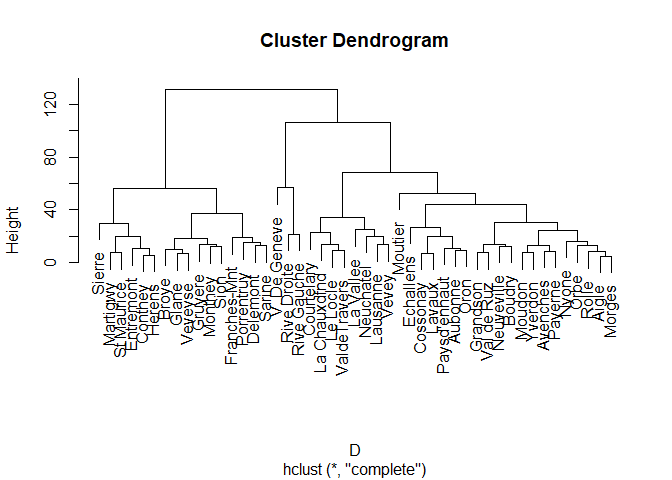<!-- -->

When looking at this dendrogram, we may choose to cut the tree at K=3.
In order to obtain the final clustering partition we have to “cut the
tree” at the level k = 3:

``` r
cl = cutree(hc.out, k = 3)
cl
```

    ##   Courtelary     Delemont Franches-Mnt      Moutier   Neuveville   Porrentruy 
    ##            1            2            2            1            1            2 
    ##        Broye        Glane      Gruyere       Sarine      Veveyse        Aigle 
    ##            2            2            2            2            2            1 
    ##      Aubonne     Avenches     Cossonay    Echallens     Grandson     Lausanne 
    ##            1            1            1            1            1            1 
    ##    La Vallee       Lavaux       Morges       Moudon        Nyone         Orbe 
    ##            1            1            1            1            1            1 
    ##         Oron      Payerne Paysd'enhaut        Rolle        Vevey      Yverdon 
    ##            1            1            1            1            1            1 
    ##      Conthey    Entremont       Herens     Martigwy      Monthey   St Maurice 
    ##            2            2            2            2            2            2 
    ##       Sierre         Sion       Boudry La Chauxdfnd     Le Locle    Neuchatel 
    ##            2            2            1            1            1            1 
    ##   Val de Ruz ValdeTravers V. De Geneve  Rive Droite  Rive Gauche 
    ##            1            1            3            3            3

It is also possible to exploit the numerical values that are stored in
the ‘hc.out’ vector to draw a similar curve as for k-means and choose k:

``` r
plot(hc.out$height, type = 'b')
```

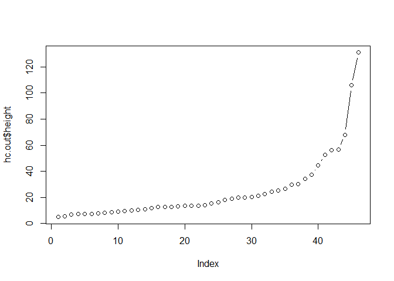<!-- -->

From this figure (which goes from K=N to K=1 because of the nature of
the hierarchical algorithm) one may pick K=3 or 4.

> Exercice: run ‘hclust’ with the different distances for K=3 and
> compare the results

``` r
hc.out = list()
hc.out[[1]] = hclust(D,method='complete')
hc.out[[2]] = hclust(D,method='single')
hc.out[[3]] = hclust(D,method='ward.D2')
hc.out[[4]] = hclust(D,method='centroid')

par(mfrow=c(2,2))
for (i in 1:4) plot(hc.out[[i]])
```

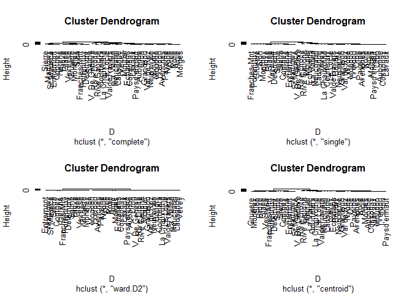<!-- -->

According to the form of the dentrograms we should keep only Ward and
Complte (the 3 other ones have the stair form which is the mark of an
abnormal clsutering). Fo Ward, an appropriate K would be 2 and 3 for
Complete.

Let’s now cut the trees and look at the results using the pair plot:

``` r
cl1 = cutree(hc.out[[1]], k=3)
cl3 = cutree(hc.out[[3]], k=2)

pairs(swiss, col=cl1, pch=19)
```

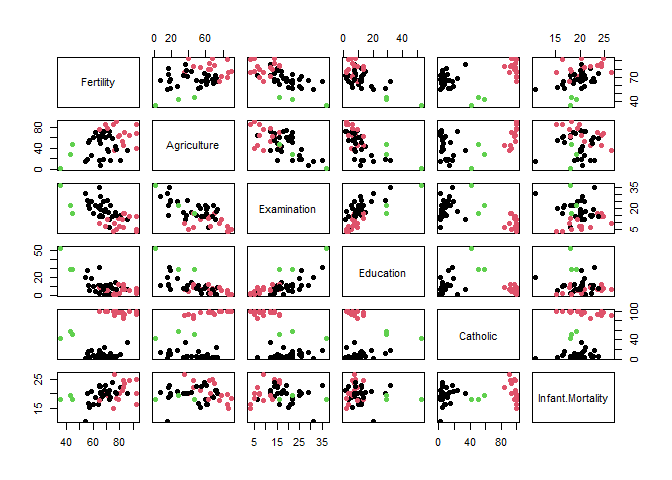<!-- -->

``` r
pairs(swiss, col=cl3, pch=19)
```

<!-- -->

In my opinion, the “complete with K=3” result is the most meaningfull
because it allows to better understand the swiss society of this period.

> Exercice: compare the results of kmeans and hclust

``` r
# Hclust
pairs(swiss, col=cl1, pch=19)
```

<!-- -->

``` r
# k-means
kmeans.out  = kmeans(swiss, centers = 4, nstart =10)
pairs(swiss,col = kmeans.out$cluster, pch=19)
```

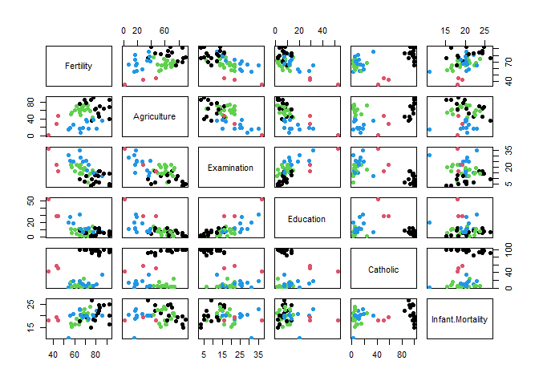<!-- -->

Here we see how the clustering is helpful to understand the data without
any prior knowledge of the historical period. =\> Clustering is a
powerful tool to reveal the information hidden in data sets

## The EM algorithm and the Gaussian mixture model (GMM)

Let’s first try to code a simple EM algorithm for a GMM with fixed
covariance matrices to simplify:

\[p(x,\theta) = \sum_{k=1}^K \pi_k \mathcal{N}(x; \mu_k, I)\]

``` r
myEM <- function(X,K,maxit=20){
  # This algo implements EM for bivariate data
  n = length(x)
  P = matrix(NA,nrow = n, ncol = K)
  prop = rep(1/K, K)
  mu = rnorm(K,0,1)
  
  for(it in 1:maxit){
    # E step
    for (k in 1:K){
      P[,k] = prop[k] * dnorm(x, mean=mu[k], sd=1)
    }
    P = P / t(t(rowSums(P)))%*%matrix(1, nrow=1, ncol=K) # normalization of the post probas
    
    # M step
    for (k in 1:K){
      prop[k] = sum(P[,k]) / n
      mu[k] = sum(P[,k]*x) / sum(P[,k])
    }
    
    # plots the means
    plot(cbind(x, rep(0,300)), col=max.col(P), ylim=c(-0.5,0.5))
    lines(density(x), col ='green')
    points(cbind(mu, rep(0,K)), type='p', pch=19, col=1:K, cex=3)
    lines(density(x[max.col(P)==1]), col ='black')
    lines(density(x[max.col(P)==2]), col ='red')
    Sys.sleep(1)
  }
  out = list(P=P, prop=prop, mu=mu)  
}

# To test this code let's simulate some data
x = c(rnorm(100,-2,1), rnorm(200,0.5,1))
y = rep(1:2, c(100,200))
plot(cbind(x,rep(0,300)), col=y, ylim=c(-0.5,0.5))
lines(density(x), col='green')
```

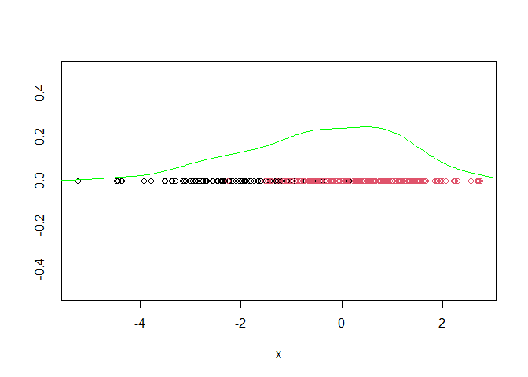<!-- -->

``` r
# Run EM on this example
out = myEM(x,2)
```

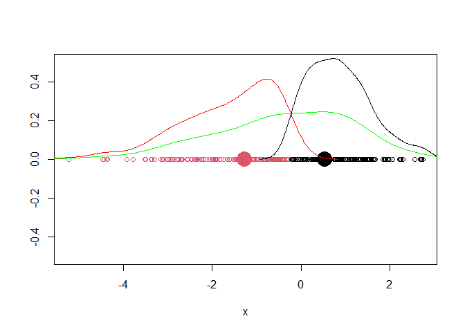<!-- -->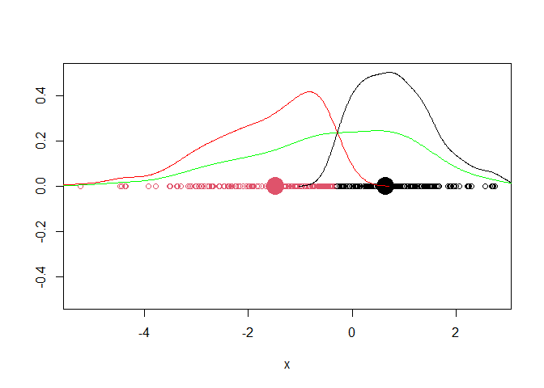<!-- --><!-- --><!-- --><!-- -->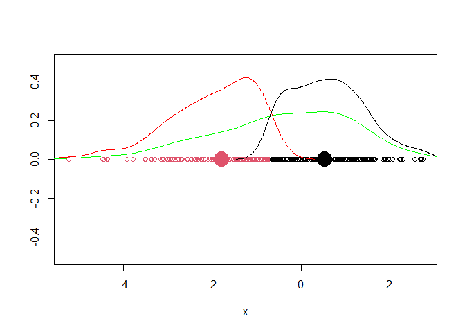<!-- --><!-- --><!-- -->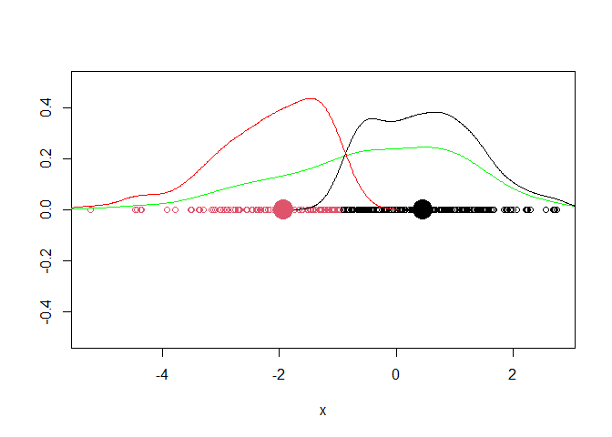<!-- -->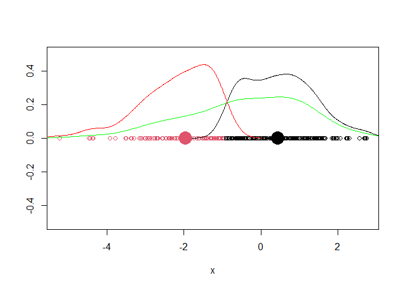<!-- --><!-- --><!-- -->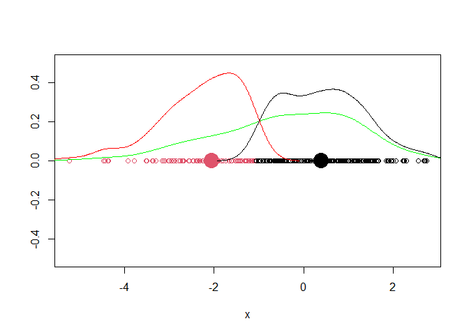<!-- --><!-- -->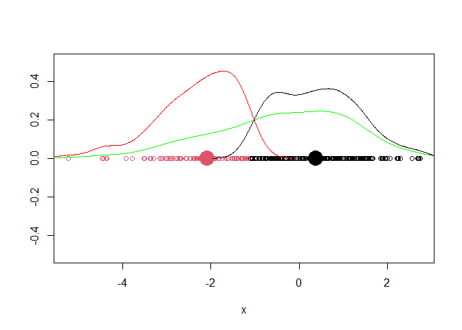<!-- -->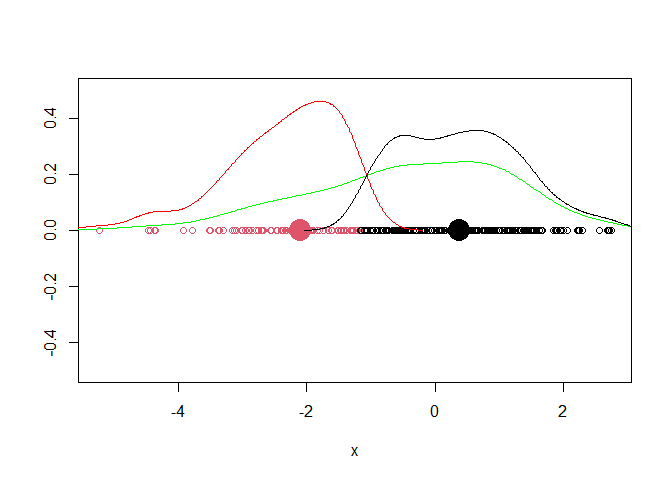<!-- --><!-- --><!-- --><!-- -->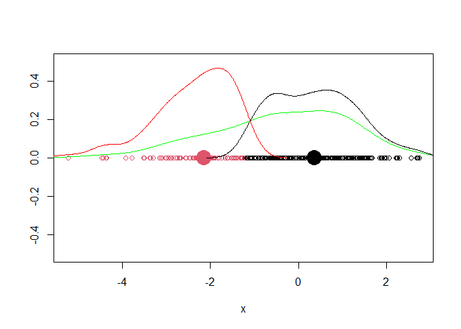<!-- -->

This small piece of code allowed us to have a look at the effect of each
iteration of the EM algorithm on the means, the proportions and the
cluster memberships.

Let’s now consider a real case with th swiss data and with a more
serious code with the Mclust package. This is probably the most popular
package for performing model-based clustering?

``` r
#install.packages('mclust')
library(mclust)
```

    ## Package 'mclust' version 5.4.6
    ## Type 'citation("mclust")' for citing this R package in publications.

Exercice: use mclust to cluster the swiss data

``` r
data("swiss")

library('mclust')

GMM.out  = Mclust(swiss)
GMM.out
```

    ## 'Mclust' model object: (EEE,3) 
    ## 
    ## Available components: 
    ##  [1] "call"           "data"           "modelName"      "n"             
    ##  [5] "d"              "G"              "BIC"            "loglik"        
    ##  [9] "df"             "bic"            "icl"            "hypvol"        
    ## [13] "parameters"     "z"              "classification" "uncertainty"

``` r
summary(GMM.out)
```

    ## ---------------------------------------------------- 
    ## Gaussian finite mixture model fitted by EM algorithm 
    ## ---------------------------------------------------- 
    ## 
    ## Mclust EEE (ellipsoidal, equal volume, shape and orientation) model with 3
    ## components: 
    ## 
    ##  log-likelihood  n df       BIC       ICL
    ##       -934.9916 47 41 -2027.839 -2027.839
    ## 
    ## Clustering table:
    ##  1  2  3 
    ## 28 16  3

``` r
plot(GMM.out, what = c("BIC"))
```

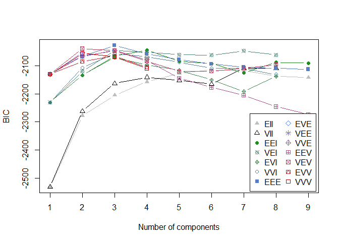<!-- -->

``` r
plot(GMM.out, what = c("classification"))
```

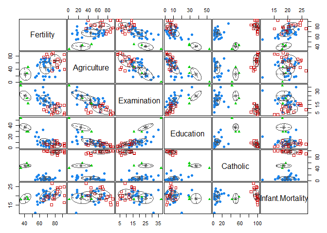<!-- -->

``` r
plot(GMM.out, what = c("uncertainty"))
```

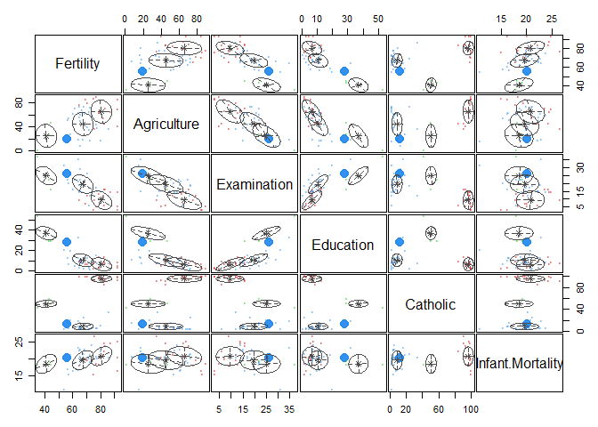<!-- -->

On this example, the mclust clustering looks very similar to the one
provided by hclust with the complete linkage.

With uncertainty pairs, the larger is the point, the larger is the
clustering uncertainty. Thisvinformation is directly extract from the
output of the algorithm.

``` r
round(GMM.out$z,3)
```

    ##              [,1] [,2] [,3]
    ## Courtelary      1    0    0
    ## Delemont        0    1    0
    ## Franches-Mnt    0    1    0
    ## Moutier         1    0    0
    ## Neuveville      1    0    0
    ## Porrentruy      0    1    0
    ## Broye           0    1    0
    ## Glane           0    1    0
    ## Gruyere         0    1    0
    ## Sarine          0    1    0
    ## Veveyse         0    1    0
    ## Aigle           1    0    0
    ## Aubonne         1    0    0
    ## Avenches        1    0    0
    ## Cossonay        1    0    0
    ## Echallens       1    0    0
    ## Grandson        1    0    0
    ## Lausanne        1    0    0
    ## La Vallee       1    0    0
    ## Lavaux          1    0    0
    ## Morges          1    0    0
    ## Moudon          1    0    0
    ## Nyone           1    0    0
    ## Orbe            1    0    0
    ## Oron            1    0    0
    ## Payerne         1    0    0
    ## Paysd'enhaut    1    0    0
    ## Rolle           1    0    0
    ## Vevey           1    0    0
    ## Yverdon         1    0    0
    ## Conthey         0    1    0
    ## Entremont       0    1    0
    ## Herens          0    1    0
    ## Martigwy        0    1    0
    ## Monthey         0    1    0
    ## St Maurice      0    1    0
    ## Sierre          0    1    0
    ## Sion            0    1    0
    ## Boudry          1    0    0
    ## La Chauxdfnd    1    0    0
    ## Le Locle        1    0    0
    ## Neuchatel       1    0    0
    ## Val de Ruz      1    0    0
    ## ValdeTravers    1    0    0
    ## V. De Geneve    0    0    1
    ## Rive Droite     0    0    1
    ## Rive Gauche     0    0    1

It is also possible to look at the mixture means (and also variances)

``` r
GMM.out$parameters$mean
```

    ##                       [,1]     [,2]     [,3]
    ## Fertility        67.335714 80.55000 40.83333
    ## Agriculture      44.900000 65.51875 25.16667
    ## Examination      19.607143  9.43750 25.00000
    ## Education        10.678571  6.62500 37.00000
    ## Catholic          8.723571 96.15000 50.36667
    ## Infant.Mortality 19.621429 20.77500 18.50000

> Remark: Other packages implement as well the GMM algorithm for
> continous data but also for categorical ones. For instance the
> ‘Rmixmod’ package allows to deal with both.

> Exercice: cluster the wine data with mclust and evaluate the quality
> of the clustering regarding the known labels.

``` r
library('MBCbook')
```

    ## Loading required package: Rmixmod

    ## Loading required package: Rcpp

    ## Rmixmod v. 2.1.5 / URI: www.mixmod.org

    ## Loading required package: MASS

    ## Loading required package: mvtnorm

    ## 
    ## Attaching package: 'mvtnorm'

    ## The following object is masked from 'package:mclust':
    ## 
    ##     dmvnorm

``` r
data("wine27")
X = wine27[,1:27] # remove categorical variables
Y = wine27$Type # Type is the solution that we want to compare to

GMM.out  = Mclust(X)
GMM.out
```

    ## 'Mclust' model object: (EVI,3) 
    ## 
    ## Available components: 
    ##  [1] "call"           "data"           "modelName"      "n"             
    ##  [5] "d"              "G"              "BIC"            "loglik"        
    ##  [9] "df"             "bic"            "icl"            "hypvol"        
    ## [13] "parameters"     "z"              "classification" "uncertainty"

``` r
summary(GMM.out)
```

    ## ---------------------------------------------------- 
    ## Gaussian finite mixture model fitted by EM algorithm 
    ## ---------------------------------------------------- 
    ## 
    ## Mclust EVI (diagonal, equal volume, varying shape) model with 3 components: 
    ## 
    ##  log-likelihood   n  df       BIC       ICL
    ##       -11557.21 178 162 -23953.87 -23955.04
    ## 
    ## Clustering table:
    ##  1  2  3 
    ## 65 63 50

``` r
round(GMM.out$z,3)
```

    ##      [,1]  [,2]  [,3]
    ## 1   1.000 0.000 0.000
    ## 2   1.000 0.000 0.000
    ## 3   1.000 0.000 0.000
    ## 4   1.000 0.000 0.000
    ## 5   1.000 0.000 0.000
    ## 6   1.000 0.000 0.000
    ## 7   1.000 0.000 0.000
    ## 8   1.000 0.000 0.000
    ## 9   1.000 0.000 0.000
    ## 10  1.000 0.000 0.000
    ## 11  1.000 0.000 0.000
    ## 12  1.000 0.000 0.000
    ## 13  1.000 0.000 0.000
    ## 14  1.000 0.000 0.000
    ## 15  1.000 0.000 0.000
    ## 16  1.000 0.000 0.000
    ## 17  1.000 0.000 0.000
    ## 18  1.000 0.000 0.000
    ## 19  1.000 0.000 0.000
    ## 20  1.000 0.000 0.000
    ## 21  1.000 0.000 0.000
    ## 22  1.000 0.000 0.000
    ## 23  1.000 0.000 0.000
    ## 24  0.999 0.001 0.000
    ## 25  1.000 0.000 0.000
    ## 26  1.000 0.000 0.000
    ## 27  1.000 0.000 0.000
    ## 28  1.000 0.000 0.000
    ## 29  1.000 0.000 0.000
    ## 30  1.000 0.000 0.000
    ## 31  1.000 0.000 0.000
    ## 32  1.000 0.000 0.000
    ## 33  1.000 0.000 0.000
    ## 34  1.000 0.000 0.000
    ## 35  1.000 0.000 0.000
    ## 36  1.000 0.000 0.000
    ## 37  1.000 0.000 0.000
    ## 38  1.000 0.000 0.000
    ## 39  1.000 0.000 0.000
    ## 40  1.000 0.000 0.000
    ## 41  1.000 0.000 0.000
    ## 42  0.998 0.002 0.000
    ## 43  1.000 0.000 0.000
    ## 44  0.316 0.684 0.000
    ## 45  1.000 0.000 0.000
    ## 46  1.000 0.000 0.000
    ## 47  1.000 0.000 0.000
    ## 48  1.000 0.000 0.000
    ## 49  1.000 0.000 0.000
    ## 50  1.000 0.000 0.000
    ## 51  1.000 0.000 0.000
    ## 52  1.000 0.000 0.000
    ## 53  1.000 0.000 0.000
    ## 54  1.000 0.000 0.000
    ## 55  1.000 0.000 0.000
    ## 56  1.000 0.000 0.000
    ## 57  1.000 0.000 0.000
    ## 58  1.000 0.000 0.000
    ## 59  1.000 0.000 0.000
    ## 60  0.000 1.000 0.000
    ## 61  0.000 1.000 0.000
    ## 62  0.000 0.017 0.983
    ## 63  0.000 1.000 0.000
    ## 64  1.000 0.000 0.000
    ## 65  0.000 1.000 0.000
    ## 66  0.112 0.888 0.000
    ## 67  1.000 0.000 0.000
    ## 68  0.000 1.000 0.000
    ## 69  0.000 0.999 0.001
    ## 70  0.000 1.000 0.000
    ## 71  0.000 1.000 0.000
    ## 72  0.996 0.004 0.000
    ## 73  0.000 1.000 0.000
    ## 74  1.000 0.000 0.000
    ## 75  0.001 0.999 0.000
    ## 76  0.000 1.000 0.000
    ## 77  0.001 0.999 0.000
    ## 78  0.000 1.000 0.000
    ## 79  0.000 1.000 0.000
    ## 80  0.000 1.000 0.000
    ## 81  0.000 1.000 0.000
    ## 82  0.009 0.991 0.000
    ## 83  0.000 1.000 0.000
    ## 84  0.000 0.004 0.996
    ## 85  0.000 1.000 0.000
    ## 86  0.000 1.000 0.000
    ## 87  0.000 1.000 0.000
    ## 88  0.000 1.000 0.000
    ## 89  0.000 1.000 0.000
    ## 90  0.000 1.000 0.000
    ## 91  0.000 1.000 0.000
    ## 92  0.000 1.000 0.000
    ## 93  0.000 1.000 0.000
    ## 94  0.000 1.000 0.000
    ## 95  1.000 0.000 0.000
    ## 96  0.000 1.000 0.000
    ## 97  0.000 1.000 0.000
    ## 98  0.001 0.999 0.000
    ## 99  0.991 0.009 0.000
    ## 100 0.000 1.000 0.000
    ## 101 0.000 1.000 0.000
    ## 102 0.000 1.000 0.000
    ## 103 0.000 1.000 0.000
    ## 104 0.000 1.000 0.000
    ## 105 0.000 1.000 0.000
    ## 106 0.000 1.000 0.000
    ## 107 0.000 1.000 0.000
    ## 108 0.000 1.000 0.000
    ## 109 0.000 1.000 0.000
    ## 110 0.028 0.972 0.000
    ## 111 0.000 1.000 0.000
    ## 112 0.000 1.000 0.000
    ## 113 0.000 1.000 0.000
    ## 114 0.000 1.000 0.000
    ## 115 0.000 1.000 0.000
    ## 116 0.000 1.000 0.000
    ## 117 0.000 1.000 0.000
    ## 118 0.000 1.000 0.000
    ## 119 0.000 0.999 0.001
    ## 120 0.000 1.000 0.000
    ## 121 0.000 1.000 0.000
    ## 122 1.000 0.000 0.000
    ## 123 0.000 1.000 0.000
    ## 124 0.000 1.000 0.000
    ## 125 0.000 1.000 0.000
    ## 126 0.000 1.000 0.000
    ## 127 0.000 1.000 0.000
    ## 128 0.000 1.000 0.000
    ## 129 0.000 1.000 0.000
    ## 130 0.000 1.000 0.000
    ## 131 0.000 0.000 1.000
    ## 132 0.000 0.000 1.000
    ## 133 0.000 0.000 1.000
    ## 134 0.000 0.000 1.000
    ## 135 0.000 0.000 1.000
    ## 136 0.000 0.000 1.000
    ## 137 0.000 0.000 1.000
    ## 138 0.000 0.000 1.000
    ## 139 0.000 0.000 1.000
    ## 140 0.000 0.000 1.000
    ## 141 0.000 0.000 1.000
    ## 142 0.000 0.000 1.000
    ## 143 0.000 0.000 1.000
    ## 144 0.000 0.000 1.000
    ## 145 0.000 0.000 1.000
    ## 146 0.000 0.000 1.000
    ## 147 0.000 0.000 1.000
    ## 148 0.000 0.000 1.000
    ## 149 0.000 0.000 1.000
    ## 150 0.000 0.000 1.000
    ## 151 0.000 0.000 1.000
    ## 152 0.000 0.000 1.000
    ## 153 0.000 0.000 1.000
    ## 154 0.000 0.000 1.000
    ## 155 0.000 0.000 1.000
    ## 156 0.000 0.000 1.000
    ## 157 0.000 0.000 1.000
    ## 158 0.000 0.000 1.000
    ## 159 0.000 0.000 1.000
    ## 160 0.000 0.000 1.000
    ## 161 0.000 0.000 1.000
    ## 162 0.000 0.000 1.000
    ## 163 0.000 0.000 1.000
    ## 164 0.000 0.000 1.000
    ## 165 0.000 0.000 1.000
    ## 166 0.000 0.000 1.000
    ## 167 0.000 0.000 1.000
    ## 168 0.000 0.000 1.000
    ## 169 0.000 0.000 1.000
    ## 170 0.000 0.000 1.000
    ## 171 0.000 0.000 1.000
    ## 172 0.000 0.000 1.000
    ## 173 0.000 0.000 1.000
    ## 174 0.000 0.000 1.000
    ## 175 0.000 0.000 1.000
    ## 176 0.000 0.000 1.000
    ## 177 0.000 0.000 1.000
    ## 178 0.000 0.000 1.000

``` r
GMM.out$parameters$mean
```

    ##                                      [,1]        [,2]        [,3]
    ## Alcohol                        13.6194432  12.2406618  13.1415714
    ## Sugar.free_extract             26.6352063  24.0791943  25.0072939
    ## Fixed_acidity                  75.8578314  81.7707202 103.3055087
    ## Tartaric_acid                   1.6278239   1.9347408   2.5674755
    ## Malic_acid                      1.9327952   1.9844166   3.3053791
    ## Uronic_acids                    0.8285766   0.8062941   1.1632564
    ## pH                              3.3364800   3.3023982   3.2614302
    ## Ash                             2.4507308   2.2304731   2.4265382
    ## Alcalinity_of_ash              17.5658500  20.0332620  21.3473038
    ## Potassium                     894.5487204 861.1243327 888.0381877
    ## Calcium                        66.1328391  94.5407530  72.6743700
    ## Magnesium                     105.6008639  94.1721408  99.0405227
    ## Phosphate                     426.0191600 318.4908764 343.0738110
    ## Chloride                       76.4180494  67.4346556  41.6376610
    ## Total_phenols                   2.8805480   2.1701426   1.6848966
    ## Flavanoids                      3.0195410   1.9673724   0.8099459
    ## Nonflavanoid_phenols            0.2855524   0.3693728   0.4523622
    ## Proanthocyanins                 1.9001404   1.6177408   1.1523306
    ## Color_Intensity                 5.4083096   2.8912511   7.3119716
    ## Hue                             1.0755313   1.0462152   0.6916959
    ## OD280.OD315_of_diluted_wines    3.1584390   2.7774116   1.6882240
    ## OD280.OD315_of_flavanoids       3.4468295   3.3645951   1.8892175
    ## Glycerol                        9.8340931   7.7171370   8.8385784
    ## X2.3.butanediol               756.1795768 651.9022361 801.0645450
    ## Total_nitrogen                268.3747885 236.0992608 212.1866156
    ## Proline                      1057.8894603 519.6741328 624.0680561
    ## Methanol                      111.6382537 104.4364673 114.4190635

``` r
GMM.out$classification
```

    ##   1   2   3   4   5   6   7   8   9  10  11  12  13  14  15  16  17  18  19  20 
    ##   1   1   1   1   1   1   1   1   1   1   1   1   1   1   1   1   1   1   1   1 
    ##  21  22  23  24  25  26  27  28  29  30  31  32  33  34  35  36  37  38  39  40 
    ##   1   1   1   1   1   1   1   1   1   1   1   1   1   1   1   1   1   1   1   1 
    ##  41  42  43  44  45  46  47  48  49  50  51  52  53  54  55  56  57  58  59  60 
    ##   1   1   1   2   1   1   1   1   1   1   1   1   1   1   1   1   1   1   1   2 
    ##  61  62  63  64  65  66  67  68  69  70  71  72  73  74  75  76  77  78  79  80 
    ##   2   3   2   1   2   2   1   2   2   2   2   1   2   1   2   2   2   2   2   2 
    ##  81  82  83  84  85  86  87  88  89  90  91  92  93  94  95  96  97  98  99 100 
    ##   2   2   2   3   2   2   2   2   2   2   2   2   2   2   1   2   2   2   1   2 
    ## 101 102 103 104 105 106 107 108 109 110 111 112 113 114 115 116 117 118 119 120 
    ##   2   2   2   2   2   2   2   2   2   2   2   2   2   2   2   2   2   2   2   2 
    ## 121 122 123 124 125 126 127 128 129 130 131 132 133 134 135 136 137 138 139 140 
    ##   2   1   2   2   2   2   2   2   2   2   3   3   3   3   3   3   3   3   3   3 
    ## 141 142 143 144 145 146 147 148 149 150 151 152 153 154 155 156 157 158 159 160 
    ##   3   3   3   3   3   3   3   3   3   3   3   3   3   3   3   3   3   3   3   3 
    ## 161 162 163 164 165 166 167 168 169 170 171 172 173 174 175 176 177 178 
    ##   3   3   3   3   3   3   3   3   3   3   3   3   3   3   3   3   3   3

``` r
plot(GMM.out, what = c("BIC"))
```

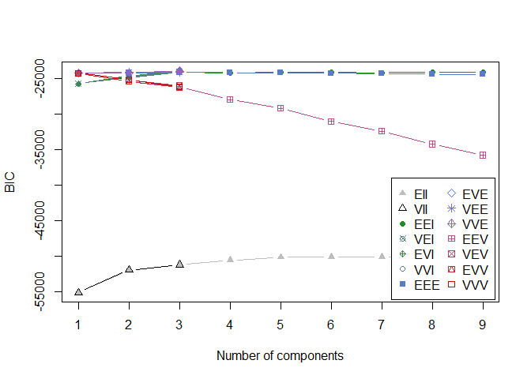<!-- -->

A way to compare the clustering with the true partition is to display
the confusion matrix:

``` r
table(Y, GMM.out$classification)
```

    ##             
    ## Y             1  2  3
    ##   Barbera     0  0 48
    ##   Barolo     58  1  0
    ##   Grignolino  7 62  2

Compare confusion matrix with K means

``` r
# k-means
kmeans.out  = kmeans(X, centers = 3, nstart =10)
table(Y, kmeans.out$cluster)
```

    ##             
    ## Y             1  2  3
    ##   Barbera     0 34 14
    ##   Barolo     46 13  0
    ##   Grignolino  1 18 52

On this specific example kmeans turns out to find clusters that are very
different than the ones of mclust and the true partition.

# Dimension reduction (using PCA)

Let’s consider the ‘decathlon data’ which are availlable in the
FactoMineR package.

``` r
# install.packages("FactoMineR")
library(FactoMineR)

data(decathlon)
X = decathlon[,1:10]
X
```

    ##              100m Long.jump Shot.put High.jump  400m 110m.hurdle Discus
    ## SEBRLE      11.04      7.58    14.83      2.07 49.81       14.69  43.75
    ## CLAY        10.76      7.40    14.26      1.86 49.37       14.05  50.72
    ## KARPOV      11.02      7.30    14.77      2.04 48.37       14.09  48.95
    ## BERNARD     11.02      7.23    14.25      1.92 48.93       14.99  40.87
    ## YURKOV      11.34      7.09    15.19      2.10 50.42       15.31  46.26
    ## WARNERS     11.11      7.60    14.31      1.98 48.68       14.23  41.10
    ## ZSIVOCZKY   11.13      7.30    13.48      2.01 48.62       14.17  45.67
    ## McMULLEN    10.83      7.31    13.76      2.13 49.91       14.38  44.41
    ## MARTINEAU   11.64      6.81    14.57      1.95 50.14       14.93  47.60
    ## HERNU       11.37      7.56    14.41      1.86 51.10       15.06  44.99
    ## BARRAS      11.33      6.97    14.09      1.95 49.48       14.48  42.10
    ## NOOL        11.33      7.27    12.68      1.98 49.20       15.29  37.92
    ## BOURGUIGNON 11.36      6.80    13.46      1.86 51.16       15.67  40.49
    ## Sebrle      10.85      7.84    16.36      2.12 48.36       14.05  48.72
    ## Clay        10.44      7.96    15.23      2.06 49.19       14.13  50.11
    ## Karpov      10.50      7.81    15.93      2.09 46.81       13.97  51.65
    ## Macey       10.89      7.47    15.73      2.15 48.97       14.56  48.34
    ## Warners     10.62      7.74    14.48      1.97 47.97       14.01  43.73
    ## Zsivoczky   10.91      7.14    15.31      2.12 49.40       14.95  45.62
    ## Hernu       10.97      7.19    14.65      2.03 48.73       14.25  44.72
    ## Nool        10.80      7.53    14.26      1.88 48.81       14.80  42.05
    ## Bernard     10.69      7.48    14.80      2.12 49.13       14.17  44.75
    ## Schwarzl    10.98      7.49    14.01      1.94 49.76       14.25  42.43
    ## Pogorelov   10.95      7.31    15.10      2.06 50.79       14.21  44.60
    ## Schoenbeck  10.90      7.30    14.77      1.88 50.30       14.34  44.41
    ## Barras      11.14      6.99    14.91      1.94 49.41       14.37  44.83
    ## Smith       10.85      6.81    15.24      1.91 49.27       14.01  49.02
    ## Averyanov   10.55      7.34    14.44      1.94 49.72       14.39  39.88
    ## Ojaniemi    10.68      7.50    14.97      1.94 49.12       15.01  40.35
    ## Smirnov     10.89      7.07    13.88      1.94 49.11       14.77  42.47
    ## Qi          11.06      7.34    13.55      1.97 49.65       14.78  45.13
    ## Drews       10.87      7.38    13.07      1.88 48.51       14.01  40.11
    ## Parkhomenko 11.14      6.61    15.69      2.03 51.04       14.88  41.90
    ## Terek       10.92      6.94    15.15      1.94 49.56       15.12  45.62
    ## Gomez       11.08      7.26    14.57      1.85 48.61       14.41  40.95
    ## Turi        11.08      6.91    13.62      2.03 51.67       14.26  39.83
    ## Lorenzo     11.10      7.03    13.22      1.85 49.34       15.38  40.22
    ## Karlivans   11.33      7.26    13.30      1.97 50.54       14.98  43.34
    ## Korkizoglou 10.86      7.07    14.81      1.94 51.16       14.96  46.07
    ## Uldal       11.23      6.99    13.53      1.85 50.95       15.09  43.01
    ## Casarsa     11.36      6.68    14.92      1.94 53.20       15.39  48.66
    ##             Pole.vault Javeline  1500m
    ## SEBRLE            5.02    63.19 291.70
    ## CLAY              4.92    60.15 301.50
    ## KARPOV            4.92    50.31 300.20
    ## BERNARD           5.32    62.77 280.10
    ## YURKOV            4.72    63.44 276.40
    ## WARNERS           4.92    51.77 278.10
    ## ZSIVOCZKY         4.42    55.37 268.00
    ## McMULLEN          4.42    56.37 285.10
    ## MARTINEAU         4.92    52.33 262.10
    ## HERNU             4.82    57.19 285.10
    ## BARRAS            4.72    55.40 282.00
    ## NOOL              4.62    57.44 266.60
    ## BOURGUIGNON       5.02    54.68 291.70
    ## Sebrle            5.00    70.52 280.01
    ## Clay              4.90    69.71 282.00
    ## Karpov            4.60    55.54 278.11
    ## Macey             4.40    58.46 265.42
    ## Warners           4.90    55.39 278.05
    ## Zsivoczky         4.70    63.45 269.54
    ## Hernu             4.80    57.76 264.35
    ## Nool              5.40    61.33 276.33
    ## Bernard           4.40    55.27 276.31
    ## Schwarzl          5.10    56.32 273.56
    ## Pogorelov         5.00    53.45 287.63
    ## Schoenbeck        5.00    60.89 278.82
    ## Barras            4.60    64.55 267.09
    ## Smith             4.20    61.52 272.74
    ## Averyanov         4.80    54.51 271.02
    ## Ojaniemi          4.60    59.26 275.71
    ## Smirnov           4.70    60.88 263.31
    ## Qi                4.50    60.79 272.63
    ## Drews             5.00    51.53 274.21
    ## Parkhomenko       4.80    65.82 277.94
    ## Terek             5.30    50.62 290.36
    ## Gomez             4.40    60.71 269.70
    ## Turi              4.80    59.34 290.01
    ## Lorenzo           4.50    58.36 263.08
    ## Karlivans         4.50    52.92 278.67
    ## Korkizoglou       4.70    53.05 317.00
    ## Uldal             4.50    60.00 281.70
    ## Casarsa           4.40    58.62 296.12

To perform PCA we use ‘princomp’ function

``` r
pc = princomp(X)
pc
```

    ## Call:
    ## princomp(x = X)
    ## 
    ## Standard deviations:
    ##      Comp.1      Comp.2      Comp.3      Comp.4      Comp.5      Comp.6 
    ## 11.61065403  4.78910847  3.12206072  1.05698409  0.58972067  0.36425523 
    ##      Comp.7      Comp.8      Comp.9     Comp.10 
    ##  0.24917123  0.22222732  0.15825005  0.07006272 
    ## 
    ##  10  variables and  41 observations.

We now need to select the number of components to retain:

``` r
summary(pc)
```

    ## Importance of components:
    ##                            Comp.1    Comp.2    Comp.3      Comp.4      Comp.5
    ## Standard deviation     11.6106540 4.7891085 3.1220607 1.056984087 0.589720672
    ## Proportion of Variance  0.7965959 0.1355296 0.0575980 0.006601788 0.002055026
    ## Cumulative Proportion   0.7965959 0.9321255 0.9897235 0.996325247 0.998380274
    ##                              Comp.6      Comp.7      Comp.8       Comp.9
    ## Standard deviation     0.3642552340 0.249171229 0.222227318 0.1582500495
    ## Proportion of Variance 0.0007840365 0.000366877 0.000291823 0.0001479832
    ## Cumulative Proportion  0.9991643100 0.999531187 0.999823010 0.9999709933
    ##                             Comp.10
    ## Standard deviation     7.006272e-02
    ## Proportion of Variance 2.900673e-05
    ## Cumulative Proportion  1.000000e+00

If we apply the rule of the 90% then 2 componenets are enough on this
example (93;21% \> 90%)

``` r
screeplot(pc)
```

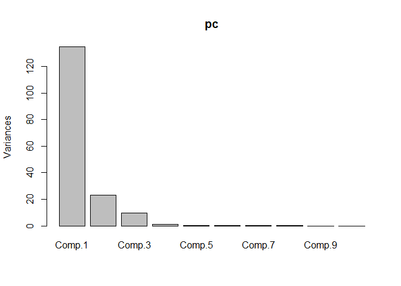<!-- -->

If we apply the rule of the ‘break’ in the eigenvalue scree then we
prefer d=3 here.

If we apply the scree-test of Cattell:

``` r
diff = abs(diff(pc$sdev))
plot(diff, type='b')
abline(h = 0.1*max(diff), lty=2, col='blue')
```

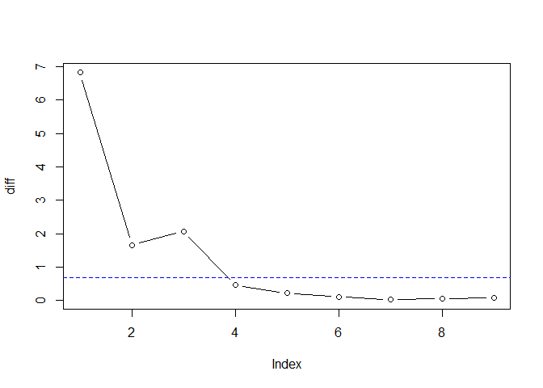<!-- -->

This test also recommends to pick d=3

The corellation circle may be obtained thanks to the ‘biplot’ function:

``` r
biplot(pc)
```

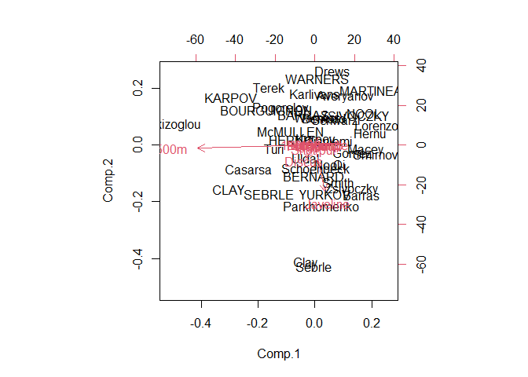<!-- -->

In the FactoMineR package there is a more clear visualization

``` r
pca = PCA(X, scale.unit = TRUE)
```

<!-- -->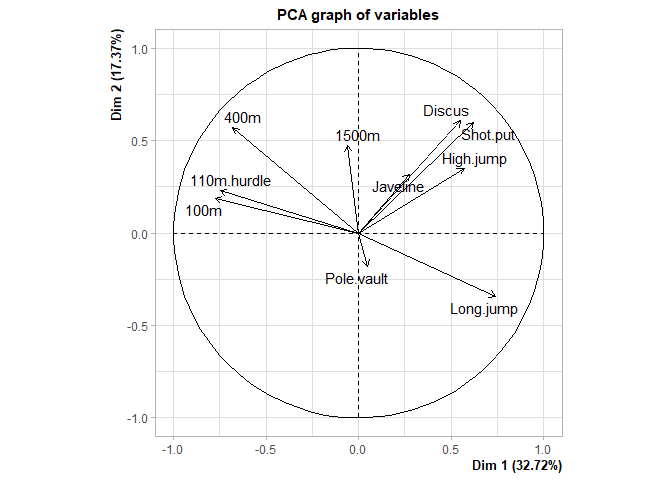<!-- -->

``` r
plot(pca)
```

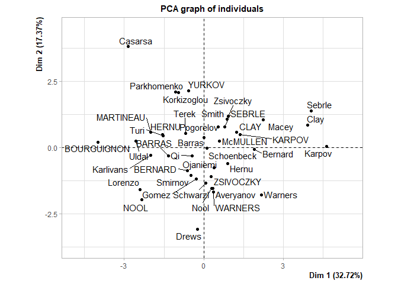<!-- -->

# Clustering in High Dimension

``` r
#install.packages('HDclassif')
library(HDclassif)

data("wine27")
X = scale(wine27[,1:27]) # scale is used when data have different units
Y = wine27$Type

out = hddc (X,3)

table(Y, out$cl)
```

    ##             
    ## Y             1  2  3
    ##   Barbera    48  0  0
    ##   Barolo      0 58  1
    ##   Grignolino  1  2 68
