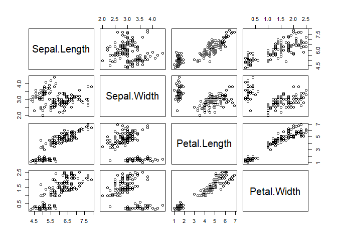

Descriptive Statistics
================

## About the comparison between the histogram and boxplot

``` r
data(iris)
X = iris$Sepal.Length

hist(X)
```

<!-- -->

As we can see below it’s really possible to tell a different story for
the same data by tuning the histogram. In such case it is better to use
boxplots.

``` r
hist(X,breaks=50)
```

<!-- -->

``` r
hist(X,breaks=2)
```

<!-- -->

Now, with the boxplot:

``` r
boxplot(X,horizontal = TRUE)
```

<!-- -->

``` r
hist(X,freq=FALSE)
lines(density(X),lwd=2,col=2)
```

<!-- -->

## About the scatter and pair plots

``` r
data(iris)
head(iris)
```

    ##   Sepal.Length Sepal.Width Petal.Length Petal.Width Species
    ## 1          5.1         3.5          1.4         0.2  setosa
    ## 2          4.9         3.0          1.4         0.2  setosa
    ## 3          4.7         3.2          1.3         0.2  setosa
    ## 4          4.6         3.1          1.5         0.2  setosa
    ## 5          5.0         3.6          1.4         0.2  setosa
    ## 6          5.4         3.9          1.7         0.4  setosa

``` r
plot(iris[,1:2],type='p',col='lavender',pch=19)
```

<!-- -->

``` r
cls = as.numeric(iris$Species)
plot(iris[,1:2],type='p',col=cls,pch=cls)
legend("bottomright",legend = c("Versicolor","Setosa","Virginica"),col=1:3,pch=1:3)
```

<!-- -->

## About multivariate data

Here, the iris data set contains four continuous variables, which are
all measured in centimeters:

``` r
boxplot(iris[,-5])
```

<!-- -->

Some alternative with the histogram:

``` r
par(mfrow=c(2,2))
for (i in 1:4) hist(iris[,i])
```

<!-- -->

## The pair plot

``` r
pairs(iris[,-5])
```

<!-- -->

``` r
pairs(iris[,-5],col=as.numeric(iris$Species))
legend("bottomright",legend = c("Versicolor","Setosa","Virginica"),col=1:3,pch=19)
```

<!-- -->

## About the multivariate numerical indicators

``` r
m = mean(iris$Sepal.Length)
m
```

    ## [1] 5.843333

``` r
mu = colMeans(iris[,-5])
mu
```

    ## Sepal.Length  Sepal.Width Petal.Length  Petal.Width 
    ##     5.843333     3.057333     3.758000     1.199333

``` r
S = var(iris[,-5])
C = cor(iris[,-5])

S
```

    ##              Sepal.Length Sepal.Width Petal.Length Petal.Width
    ## Sepal.Length    0.6856935  -0.0424340    1.2743154   0.5162707
    ## Sepal.Width    -0.0424340   0.1899794   -0.3296564  -0.1216394
    ## Petal.Length    1.2743154  -0.3296564    3.1162779   1.2956094
    ## Petal.Width     0.5162707  -0.1216394    1.2956094   0.5810063

``` r
C
```

    ##              Sepal.Length Sepal.Width Petal.Length Petal.Width
    ## Sepal.Length    1.0000000  -0.1175698    0.8717538   0.8179411
    ## Sepal.Width    -0.1175698   1.0000000   -0.4284401  -0.3661259
    ## Petal.Length    0.8717538  -0.4284401    1.0000000   0.9628654
    ## Petal.Width     0.8179411  -0.3661259    0.9628654   1.0000000
