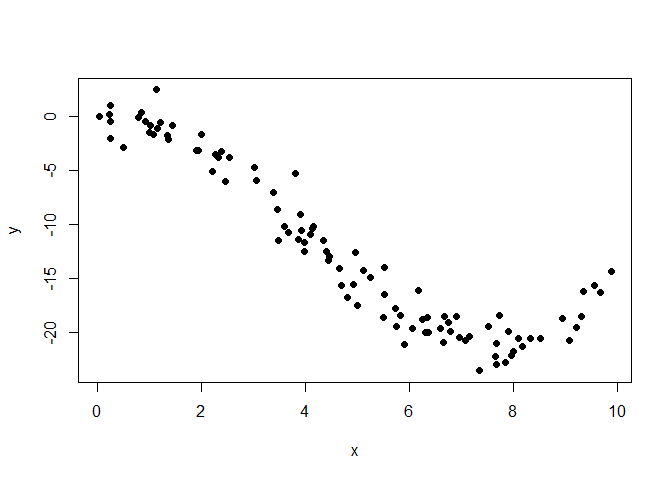
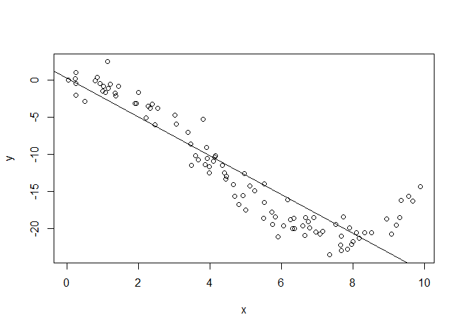
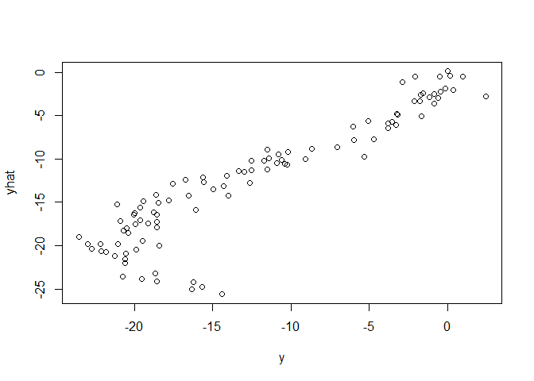
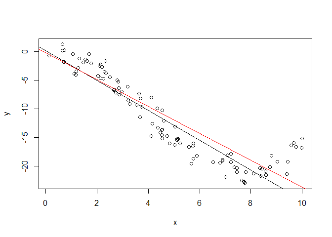
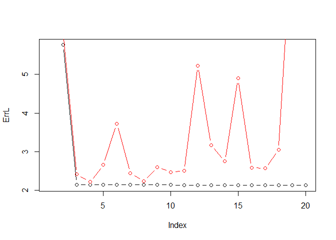
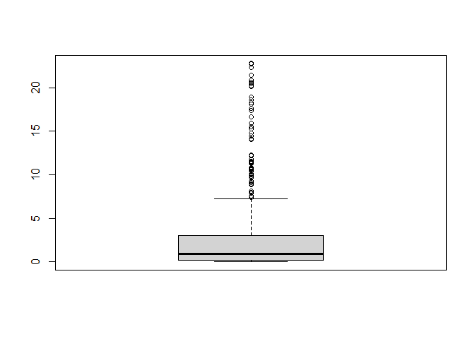
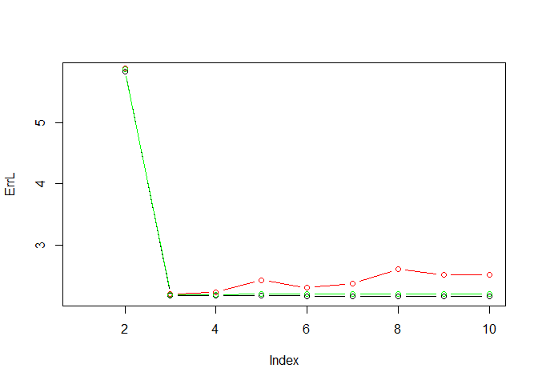
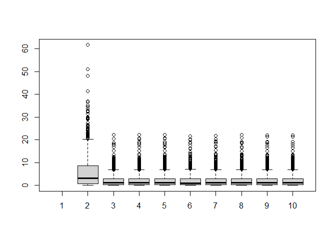
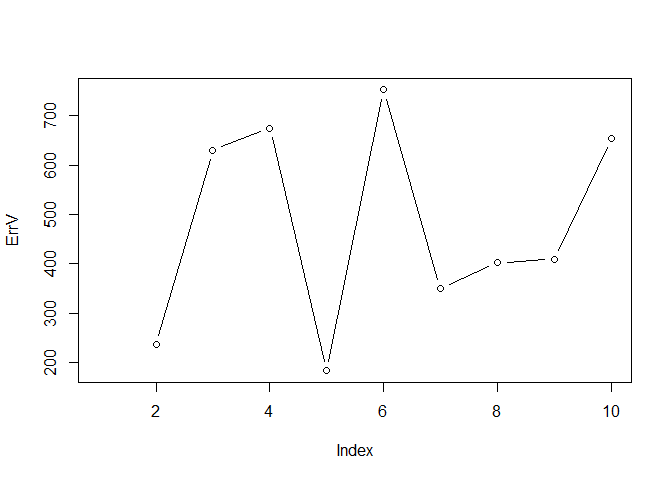

Learning process with Regression
================

# The learning process

So, we saw that it is important to evaluate (in the right way) the
predictors we learn from the data. We are going to illustrate in
practice the different concepts.

``` r
x = runif(100,0,10)
eps = rnorm(100,0,1.5)
y = 0.5 * x - 1.2 * x^2 + 0.1 * x^3 + eps
plot(x,y,type='p',pch=19)
```

<!-- -->

Let’s first try to fit a model and compute the (learning) error (in a
naive way):

``` r
# Learning step
f = lm(y ~ ., data=data.frame(x)) # or just f = lm(y ~ x)
plot(x,y,type='p')
abline(f)
```

<!-- -->

``` r
# Predict for some data (here the learning data again)
yhat = predict(f,newdata = as.data.frame(x))
plot(y,yhat,type='p')
```

<!-- -->

``` r
# Compute the learning error
ErrL = sum((y - yhat)^2) / length(yhat)
cat('Learning error:',ErrL)
```

    ## Learning error: 9.323835

> Rmk: even though this error is too optimistic (because computed on the
> same data that were used for learning the mode) this error is not
> perfect because the model is here very simple.

Let’s now use the minimal setup (= we separate the data between learning
and validation) to estimate the error of f:

``` r
# recall dataset
x = runif(100,0,10)
eps = rnorm(100,0,1.5)
y = 0.5 * x - 1.2 * x^2 + 0.1 * x^3 + eps

# Split between train and validation
train = sample(1:100,75)

# Learning step
f2 = lm(y ~ x,subset = train)
plot(x,y,type='p')
abline(f)
abline(f2,col='red')
```

<!-- -->

``` r
# Predict for the validation data
xval = data.frame(x = x[-train])
yval = y[-train]
yhat = predict(f2,newdata = xval)

# Compute the validation error
ErrV = sum((yval - yhat)^2) / length(yhat)
cat('Validation error:',ErrV)
```

    ## Validation error: 7.205385

## The overfitting effect and the selection of the model with the right complexity

So, we are going to explore models ranging from very simple to very
complex ones:

``` r
x = runif(1000,0,10) # = 1 explanatory variable
eps = rnorm(1000,0,1.5)
y = 0.5 * x - 1.2 * x^2 + 0.1 * x^3 + eps

ErrL = ErrV = rep(NA,20)
X = data.frame(x)
for (c in 2:20){
  X = data.frame(X,x^c) # we add a new variable at each iteration (x^c) to increase complexity

  # Estimation and evaluation on the whole data set (bad way!)
  f = lm(y ~ ., data = X)
  yhat = predict(f, newdata = X)
  ErrL[c] = sum((y - yhat)^2) / length(yhat)
  
  # Estimation and evaluation on train and validation (good way!)
  train = sample(1:1000,75)
  f2 = lm(y ~ .,data = X,subset = train)
  Xval = X[-train,]
  yval = y[-train]
  yhat = predict(f2,newdata = Xval)
  ErrV[c] = sum((yval - yhat)^2) / length(yhat)
}

plot(ErrL,type='b')
lines(ErrV,type='b',col='red')
```

<!-- -->

``` r
which.min(ErrL)
```

    ## [1] 20

``` r
which.min(ErrV)
```

    ## [1] 4

Finally, let’s again improve the selection of the right model by using
cross-validation.

Here we are first using CV for one specific model:

``` r
x = runif(1000,0,10)
X = data.frame(x,x^2,x^3)
eps = rnorm(100,0,1.5)
y = 0.5 * x - 1.2 * x^2 + 0.1 * x^3 + eps
ErrV = c()

# Leave-one-out CV 
for (i in 1:nrow(X)){
  # Split between training ('n-1' rows) and validation (1 row) datasets
  train = seq(1,nrow(X))[-i] # Training set = datset X without row n°i

  # Learning step on the training dataset ('n-1' rows)
  f3 = lm(y ~ .,data = X,subset = train)
  
  # Predict for validation data made of a single row (row n°i)
  Xval = X[i,] # Validation set = row n° i of the datset X
  yhat = predict(f3,newdata = Xval)
  ErrV[i] = sum((y[i] - yhat)^2) / length(yhat)
}
boxplot(ErrV)
```

<!-- -->

``` r
median(ErrV)
```

    ## [1] 0.9260917

Now, we can reproduce the procedure for choosing the best model, using
this time CV instead of a simple split:

``` r
x = runif(1000,0,10)
eps = rnorm(1000,0,1.5)
y = 0.5 * x - 1.2 * x^2 + 0.1 * x^3 + eps

ErrL = ErrV = ErrCV = rep(NA,10)
X = data.frame(x)
ErrCV.all = matrix(NA,1000,10)
for (c in 2:10){
  X = data.frame(X,x^c) # we add a new variable at each iteration (x^c) to increase complexity

  # Estimation and evaluation on the whole data set (bad way!)
  f = lm(y ~ ., data = X)
  yhat = predict(f, newdata = X)
  ErrL[c] = sum((y - yhat)^2) / length(yhat)
  
  # Estimation and evaluation on train and validation (good way!)
  train = sample(1:1000,75)
  f2 = lm(y ~ ., data = X, subset = train)
  Xval = X[-train,]
  yhat = predict(f2, newdata = Xval)
  ErrV[c] = sum((y[-train] - yhat)^2) / length(yhat)
  
  # Estimation of the error with LOO-CV (better way!)
  for (i in 1:nrow(X)){
    # Split between training ('n-1' rows) and validation (1 row) datasets
    train = seq(1,nrow(X))[-i] # Training set = dataset X without row n°i
  
    # Learning step on the training dataset
    f3 = lm(y ~ ., data = X, subset = train)
    
    # Predict for validation data made of a single row (n°i)
    Xval = X[i,] # Validation set = row n°i of the dataset X
    yhat = predict(f3, newdata = Xval)
    ErrCV.all[i,c] = sum((y[i] - yhat)^2) / length(yhat)
  }
  ErrCV[c] = mean(ErrCV.all[,c])
}

plot(ErrL,type='b')
lines(ErrV,type='b',col='red')
lines(ErrCV,type='b',col='green')
```

<!-- -->

``` r
boxplot(ErrCV.all)
```

<!-- -->

``` r
cat('Error with Learning dataset:', which.min(ErrL), '\n')
```

    ## Error with Learning dataset: 10

``` r
cat('Error with simple Validation dataset:', which.min(ErrV), '\n')
```

    ## Error with simple Validation dataset: 3

``` r
cat('Error with LOO Validation dataset:', which.min(ErrCV))
```

    ## Error with LOO Validation dataset: 3

> Exercise: write a code that allows to select the right model and for
> the selected model learn the final predictor.

``` r
x = runif(1000,0,10)
eps = rnorm(1000,0,1.5)
y = 0.5 * x - 1.2 * x^2 + 0.1 * x^3 + eps

ErrCV = rep(NA,10)
X = data.frame(x)
ErrCV.all = matrix(NA,1000,10)

for (c in 2:10){
  X = data.frame(X,x^c) # we add a new variable at each iteration (x^c) to increase complexity
  
  # Estimation of the error with LOO-CV (better way!)
  for (i in 1:nrow(X)){
    # Split between training ('n-1' rows) and validation (1 row) datasets
    train = seq(1,nrow(X))[-i] # Training set = dataset X without row n°i
  
    # Learning step on the training dataset
    f3 = lm(y ~ ., data = X, subset = train)
    
    # Predict for validation data made of a single row (n°i)
    Xval = X[i,] # Validation set = row n°i of the dataset X
    yhat = predict(f3, newdata = Xval)
    ErrCV.all[i,c] = sum((y[i] - yhat)^2) / length(yhat)
  }
  ErrCV[c] = mean(ErrCV.all[,c])
}

ind = which.min(ErrCV)
cat('The selected model is of complexity',ind,'\n')
```

    ## The selected model is of complexity 3

``` r
# Learn the final model
X = X[,1:ind]
f = lm(y ~ .,data = X)
f
```

    ## 
    ## Call:
    ## lm(formula = y ~ ., data = X)
    ## 
    ## Coefficients:
    ## (Intercept)            x          x.c        x.c.1  
    ##     -0.1008       0.6102      -1.2305       0.1022

> Exercice: Apply to dataset Ozone

``` r
# Import Datazone dataset
A = read.table('C:/Users/jakam/Documents/R/datasets/Dataset_ozone.txt', header = TRUE, sep = ';', dec = ',')
A = A[,-c(1,13,14)] # filter out categorical data 
y = A[,11] # y is the target variable is the last column of the dataset 'maxO3v'
X = A[,1:10] # X contains the explanatory variables

# Xi = matrix(NA, nrow = nrow(X), ncol = 0) # empty matrix with 0 column to collect increasing number of explanatory variables
Xi = data.frame(X[,1]) # vector to collect errors for each linear model with increasing complexity
ErrCV = ErrV = rep(NA,ncol(X)) 

for (i in 2:ncol(X)){
  Xi = data.frame(Xi,X[,i]) # we increase the complexity of the model by adding the explanatory variables one by one iteratively

  # Split between train and validation
  train = sample(1:nrow(X),0.75*nrow(X))
  
  # Learning step
  Xi.fit = lm(y ~ ., data = Xi, subset = train)
  
  # Predict for the validation data
  Xval = Xi[-train,]
  yval = y[-train]
  yhat = predict(Xi.fit, newdata = Xval)

  # Compute the validation error
  ErrV[i] = sum((yval - yhat)^2) / length(yhat)
}
cat('Validation errors:', ErrV, '\n')
```

    ## Validation errors: NA 236.7083 629.656 674.4196 182.9763 752.1578 349.3379 402.0792 409.122 652.9859

``` r
plot(ErrV,type='b')
```

<!-- -->
